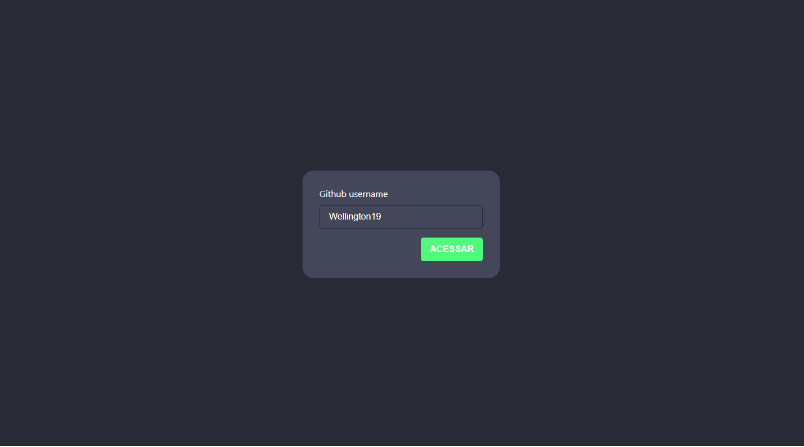
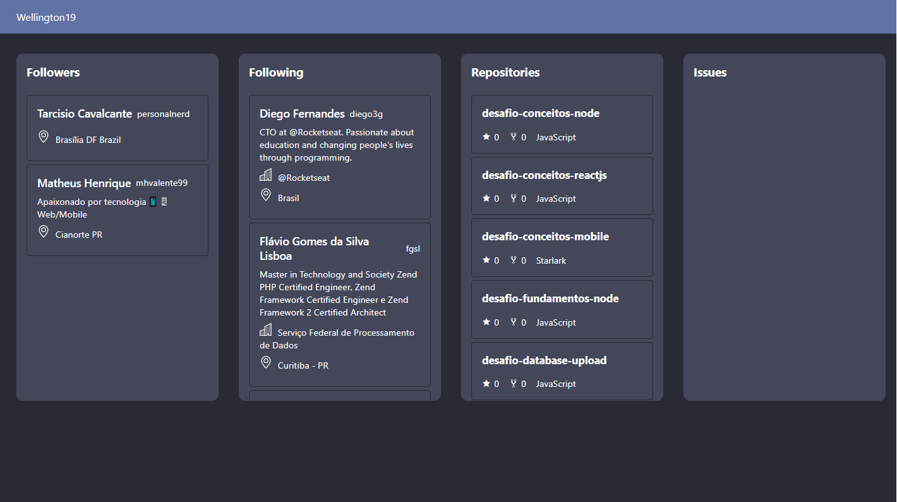

# Atividade 3

Atividade proposta na terceira aula ministrada por Vinicius Dacal, na Pós-Graduação da UniALFA Umuarama de Desenvolvimento de Aplicações para Internet e Dispositivos Móveis, que consiste em finalizar uma aplicação desenvolvida durante as aulas que comunica com a API do GitHub para pegar informações como followers, following, repositories e issues utilizando GraphQL e ao selecionar um repositório listar suas 10 issues mais recentes.
### Como rodar o código

Clone ou baixe o projeto e abra com editor de sua prefêrencia, lembre-se de executar o comando `yarn` ou `npm install` no seu terminal para instalar todas as dependências.

Para rodar a aplicação execute o comando `yarn start:api` ou `npm run start:api` para executar o servidor que faz a autenticação com a API do GitHub, em seguida:
Execute o comando `yarn start` ou `npm run start`

<h1 align="center">
  
  
  
</h1>